# Black Rabbit Rhapsody #

## Summary ##

Turn-based autobattler

## Project Resources

[Web-playable version of your game.](https://itch.io/)  
[Proposal: make your own copy of the linked doc.](https://docs.google.com/document/d/1jB2_lGxjSw8QCz2dgsFHjkJ77vtSrayT5uPSMNy5jAg/edit?usp=sharing)

## Gameplay Explanation ##

In battle, there is a skill selection UI that can be broken down into columns with each representing one attack slot.
Players can pick one of three available skills for an attack slot, or click on the button below (either portrait or
defend button) to queue up an attack skill instead. Skills are then processed in order from fastest to slowest (based on
speed number below the set of skills), left-to-right and pitted against the enemy's skills.

Player skills and enemies skills then clash against each other, rolling for highest number to see who gets to attack.
Players can do a QTE activated by clicking in order to gain more clash value. After clashing, whoever won the clash (
winning enough times to break all the enemy skill's coins) gets to attack with the remaining coins on their skill.

Once all skills are clashed or processed, the next turn begins. This goes on until one side is defeated.

**Strategy**
Pick big numbers to go up against enemy numbers. Defend when you feel like losing is inevitable.

**In this section, explain how the game should be played. Treat this as a manual within a game. Explaining the button
mappings and the most optimal gameplay strategy is encouraged.**

**Add it here if you did work that should be factored into your grade but does not fit easily into the proscribed roles!
Please include links to resources and descriptions of game-related material that does not fit into roles here.**

# External Code, Ideas, and Structure #

If your project contains code that: 1) your team did not write, and 2) does not fit cleanly into a role, please document
it in this section. Please include the author of the code, where to find the code, and note which scripts, folders, or
other files that comprise the external contribution. Additionally, include the license for the external code that
permits you to use it. You do not need to include the license for code provided by the instruction team.

If you used tutorials or other intellectual guidance to create aspects of your project, include reference to that
information as well.

Agentic tools were used for prototying an early draft of the UI code and for minor debugging.

# Team Member Contributions

This section be repeated once for each team member. Each team member should provide their name and GitHub user
information.

The general structures is

```
Team Member 1
  Main Role
    Documentation for main role.
  Sub-Role
    Documentation for Sub-Role
  Other contribtions
    Documentation for contributions to the project outside of the main and sub roles.

Team Member 2
  Main Role
    Documentation for main role.
  Sub-Role
    Documentation for Sub-Role
  Other contribtions
    Documentation for contributions to the project outside of the main and sub roles.
...
```

## Alexander Landess

### Game Logic

    asdf

### Gameplay Testing

    asdf

### Other Contributions

    asdf

## Kynan Lewis

### Level/World Designer

    asdf

### Game Feel

    asdf

### Other Contributions

    asdf

# Xiaofeng Lin

### Systems and Tools Engineer

    asdf

### Build/Release Management

    asdf

### Other Contributions

    asdf

# Danielle Chang

### Animation/Visuals

    asdf

### Narrative Design

    asdf

### Other Contributions

    asdf

# Adriano Melo Filho

### UI/Input

1. Skill Population:


*(Early version: Px means populated with skill_ID = x)*

I implemented most of the Skill UI system. When the battle begins
the [PrelimCombatHandler](https://github.com/okpom/project-horse/blob/main/scripts/prelim_combat_handler.gd) spawns
player and initializes each player’s skill deck from their SkillContainer (init_skills()), creating three independent
column pools that generate randomized skills to the UI each turn. These pools are applied visually when the handler
populates each player’s 3x3 SkillsColumn grid using _populate_columns_with_random_skills() and _
apply_column_skills_to_ui() which replaces placeholder nodes with actual TextureRects nodes and attach skill metadata.

The boss’s skill population follows a separate system. Instead of using column pools or UI grids the boss generates
skills freshly each turn
through [BattleManager._get_boss_skills()](https://github.com/okpom/project-horse/blob/main/scripts/battle_manager.gd)
which uses a placeholder fully random AI *(might be updated after submitting this)*. For each of the three boss slots
the function picks a random skill from enemy.skills.pick_random(), randomly selects a player, and randomly selects one
of that player’s three skill-bar slots to target. Then it creates a SkillSlot containing the enemy user, the chosen
skill, the boss’s slot index and the randomly selected (target_player_index, target_slot_index). Once all three are
created, ActionHandler.set_boss_skills() stores them, and ActionHandler.populate_entity_skill_bar() replaces the boss’s
placeholder UI with actual TextureRect icons and metadata.

2. Skill Selection:


*(Early version: Populates over head skills by clicking one per bottom column)*

During the Skill Selection phase
the [BattleManager](https://github.com/okpom/project-horse/blob/main/scripts/battle_manager.gd) manages all UI
interaction and selection logic to
the [ActionHandler system](https://github.com/okpom/project-horse/blob/main/scripts/action_handler.gd).
First boss skills are generated and displayed using set_boss_skills() and populate_entity_skill_bar() allowing players
to see incoming attacks before choosing responses. Then the handler sets up internal player selection structures (
setup_selection(players)), generates targeting preview arrows (prepare_preview_arrows()) and attaches click handlers to
every selectable UI node via select_player_skills(). Each skill icon in the SkillsColumn is mapped directly to its
corresponding bar slot and selection is performed through _on_column_skill_gui_input() which constructs an
ActionHandler.SkillSlot object and stores it in player_selections[player][slot]. Clicking again removes the selection (
both handled by _on_bar_slot_gui_input() and _reset_bar_slot_visual()).

Players can't begin combat until all required slots are filled; set_skill_for_slot() triggers _check_if_complete() which
emits all_selections_complete() only when every slot across all living players contains a valid selection. After combat,
the system updates the UI dynamically: consume_used_skills() removes used skills from their column pools and
replace_used_skills_in_grid() updates only the specific grid nodes involved in the selection identified through
metadata (node.get_meta("used_in_slot")). Finally, clear_selections_and_ui() resets the Skill Bars and clears metadata
so the next Skill Selection phase begins with a fresh UI.

3. Boss Targeting:


BossPreviewArrows.gif

*(Arrows indicates which skill enemy plans on attacking during clash)*

Although it's not going to make the final cut, it's something I spent a fair amount of time on. I implemented the visual
targeting preview feature that displays curved red arrows from each boss skill slot to the player slot it plans on
hitting during the Skill Selection phase. When the BattleManager finishes generating boss skills the UI call
action_handler.prepare_preview_arrows() to rebuild the preview lines every turn. The function works by clearing all old
arrows from the BossSkillsBar via bar.boss_preview_arrows.get_children() to guarantee no stale visuals stay around. Then
it iterates over each SkillSlot in boss_skills extracting its source_slot_index, target_player_index and
target_slot_index and resolving both the start node (boss UI slot) and end node (that player’s SkillsBar slot). For each
valid pair, it instantiates a new PreviewArrow from bar.ARROW_SCENE, assigns its node_start and node_end references and
adds it to the boss_preview_arrows container. Arrowed are invisible by default so they don’t clutter the UI until
needed.

The arrow is rendered in real time inside PreviewArrow._process() where the script samples the global positions of both
UI nodes each frame and generates a smooth curve between them. The arrow is trimmed using trim_start and trim_end so it
doesn’t visually overlap the UI icons, and the midpoint of the curve is lifted by curve_height giving each arrow its
distinctive high arc. I used two layered Line2D nodes (OutlineLine and MainLine) to create an outlined red effect for
clarity. Each arrow recomputes its curve every frame even as UI elements move or animate.
To control visibility I connected the boss’s HoverArea directly to _on_boss_hover_enter() and _on_boss_hover_exit()
using connect_boss_hover_signals(). When the cursor enters the boss model every arrow inside boss_preview_arrows becomes
visible including multiple overlapping arrows targeting different players. When the cursor leaves, they all hide again.

4. Skill Description Boxes:


*(Icons Not Finalized)*

I implemented the foundation for
the [Skill Description Box system](https://github.com/okpom/project-horse/blob/main/scripts/UI/skill_description_box.gd)
that provides the UI layout and the core API for showing and hiding description information. This included building the
SkillDescriptionBox scene (panel, labels, icon slot, stats fields) and writing the initial script with functions such as
show_for_skill(), update_icon(), and hide_box(). My group expanded the system by integrating the real logic for loading
skill information on hover. Instead of relying on the placeholder show_for_skill() method he embedded the skill
description population directly into the hover callback inside ActionHandler (_on_skill_hover_enter). This approach
allows the description box to pull the exact skill metadata—display name, description, rolls, coin count, and computed
odds—at the moment the mouse hovers over a skill icon in the SkillsColumn. His implementation searches for the correct
SkillDescriptionBox instance under the player’s SkillsColumn, accesses all UI nodes inside the panel (Name,
SkillDescription, Stats, etc.), and writes the appropriate values taken from the Skill object. This ensures that the
description box always reflects accurate, per-skill data.

5. Player/Boss Healthbars:


I wrote
the [original full HealthBar system](https://github.com/okpom/project-horse/commit/7a5a60d3f4400064cd71287639e9f448e37c6b69#diff-23803dbd84edd299c0f8be7fb2e0807c382ec194944d6eba587189fc7bf92abaR2)
where the bar stored its own health values, updated itself when damaged or healed, emitted signals and handled
portrait/name setup. My group later simplified and refactored it so the bar no longer manages gameplay logic. Instead
the updated [HealthBar](https://github.com/okpom/project-horse/blob/main/scripts/UI/player_health_bar.gd) now attaches
to its parent Entity and only reads current_hp and max_hp to update the UI. The Entity.take_damage() method now calls
hb.refresh() meaning the entity controls the health logic while the bar only handles display. In short, I created the
full original feature, and my group streamlined it into a clean, entity-driven UI component.

### Audio

1. Gameplay Music:

I implemented a scene driven music system from
the [title screen](https://github.com/okpom/project-horse/blob/main/scripts/title_screen.gd), into
a [cutscene](https://github.com/okpom/project-horse/blob/main/scripts/dialogue/cutscene_manager.gd) and finally into
the [multi phase boss battle](https://github.com/okpom/project-horse/blob/main/scripts/battle_manager.gd). I set up the
architecture for the music logic across all affected scenes, while my group helped attach the final audio assets and
organize the exported fields in each scene for easier editor control.
On the [Title Screen](https://github.com/okpom/project-horse/blob/main/scripts/title_screen.gd) I added a dedicated
AudioStreamPlayer2D and bound it to a new exported variable menu_music in title_screen.gd. This allows the menu to start
playing the assigned track immediately on load using Godot’s autoplay behavior.

For Cutscenes I expanded
the [CutsceneManager](https://github.com/okpom/project-horse/blob/main/scripts/dialogue/cutscene_manager.gd) by
introducing a cutscene_music export and a corresponding MusicPlayer node. When a cutscene begins in play_cutscene(), the
manager loads the appropriate track, assigns it to the player, and starts playback. When the cutscene ends, _
end_cutscene() stops the audio and the system returns control to the boss fight scene.

State Changing Music:

The Boss Fight required the most work. I added four dedicated audio players to the BossFightManager scene:
SkillMusicPlayer, CombatMusicPlayer, VictoryMusicPlayer and DefeatMusicPlayer. These players are connected to new
exported AudioStream fields in battle_manager.gd: skill_selection_music, combat_music, victory_music and defeat_music.
With these exports anyone from group can swap tracks directly in the inspector without touching code.

The main peice of the system is the _update_music() method
in [BattleManager](https://github.com/okpom/project-horse/blob/main/scripts/battle_manager.gd). It shuts off all tracks
then enables the specific player associated with the current battle state (SKILL_SELECTION, COMBAT, END_WIN, END_LOSS).
Music transitions automatically happen whenever the state changes skill selection plays its own theme, combat switches
to the main boss music and victory/defeat tracks are triggered when the encounter ends. This makes the soundtrack fully
state driven and eliminates earlier ad-hoc checks like if combat_music_player.playing.

Some of the songs I chose:

[RPG Game Music by alkakrab](https://alkakrab.itch.io/50-tracks-rpg-game-music-pack).

[8Bit Fantasy Adventure by xDeviruchi](https://xdeviruchi.itch.io/8-bit-fantasy-adventure-music-pack).

[16Bit Fantasy Adventure by xDeviruchi](https://xdeviruchi.itch.io/16-bit-fantasy-adventure-music-pack).

### Other Contributions

Rough quarter... Didn't even have time to get all my deliverables complete :(

# Justin Pak

### Producer

Project Trello (https://trello.com/b/zCzT0oPH/project-horse-ecs-179) - Project planning and task tracking kanban board
for helping
people know what they have to do, when they have to finish, and who has to work on it. I chose to use a Kanban board
over a
Gantt chart because I thought it would fit better with our team's dynamic and working process.
Also included were milestones implemented at the start of development. Other than being a part of the producer
deliverables, project
planning was discussed as a part of class during lectures regarding the project and tools you can use to help with the
process.

There were troubles with the team hitting milestones with most of the additions coming in at the eleventh hour. I
should've made the decision to have the team pivot to an idea
that better fit the team's capabilities/schedules, but the team wanted to stick with the current game plan and I went
against my gut judgement.

GDScript Format Workflow - Made a GitHub workflow for automatically formatting all pushed gdscript files. This allows
everyone to
code in their own preferred style while ensuring that all final code aligns to one consistent style. This workflow is
based on the
portion of the course that covered Godot code style and best practices.

Assigning Tasks, Holding Meetings - Listed Deliverable. Held regular team meeting to make sure everyone was on the same
page and took minutes for each meeting.

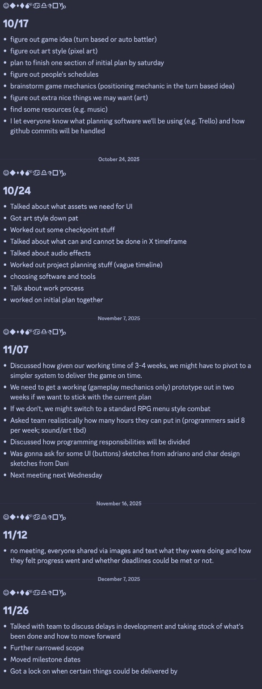

Other Producer Stuff - Tried to help be a force multiplier for the team. Helped act as a middleman between team members.
Coordinated responsibilities and task. Keep everyone on the same page. Helped support any other team members who need
assistance. Managed deadlines and scope. Made choices when things had to be delayed or scoped down. Worked to fix merge
conflicts, squash bugs, and assisted any members that needed support with their roles (programming or otherwise).

### Visual Cohesion/Style Guide

Moodboard/Style Guide - I worked with Danielle to nail down what the core aesthetic of the game should be. She created
the first set of moodboards and I created the second set to lock in on what the game's visuals would be like.
Originally, the game was leaning more towards gothic or fantasy elements.

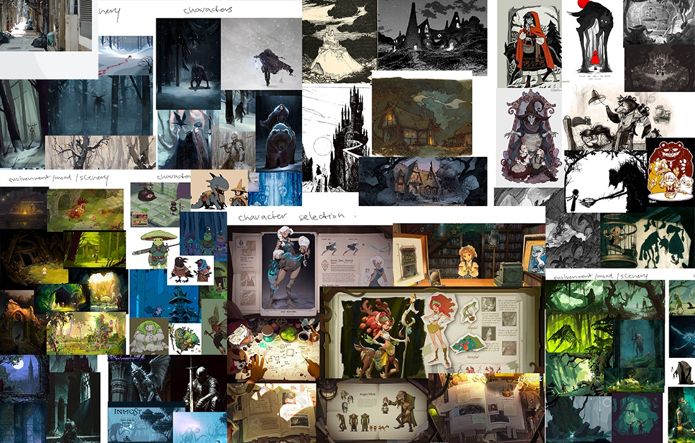

Later, we decided to go for an "urban fairytale" aesthetic that incoporates storybook and fairytale characters and
motifs into a slight run-down urban setting (one of the initial inspiration was Hong Kong in the 80/90s). The characters
moved away from cloaks and tunics and more towards suits and ties.

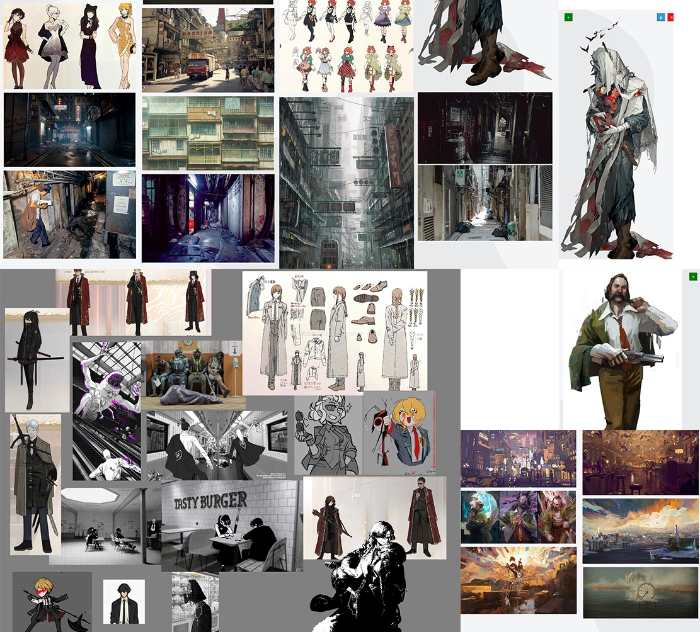

As assets were being developed, I helped make sure that characters, enemies, and the environment aligned with the visual
style that was created.

Color Palette Guidance - I worked with Danielle to ensure the art in the game aligned with the palette that was decided
upon (muted colors with clear grayscale values). Art was checked to make sure this aligned with the game's theming and
any changes regarding color were made directly on the image files themselves, saving us time on requiring in-engine
color adjustments. We were able to do this because we weren't doing anything related to lighting in the game itself.

### Other Contributions

High Level Design - The game's original high level design consists of separate classes being handled by a global state
machine. The intent was to break down the subsystems so that they are compartmentalized and can be worked on
independently of each other. This system is based on portion of the course that covered different ways of creating
systems (specifically the part that covered states).

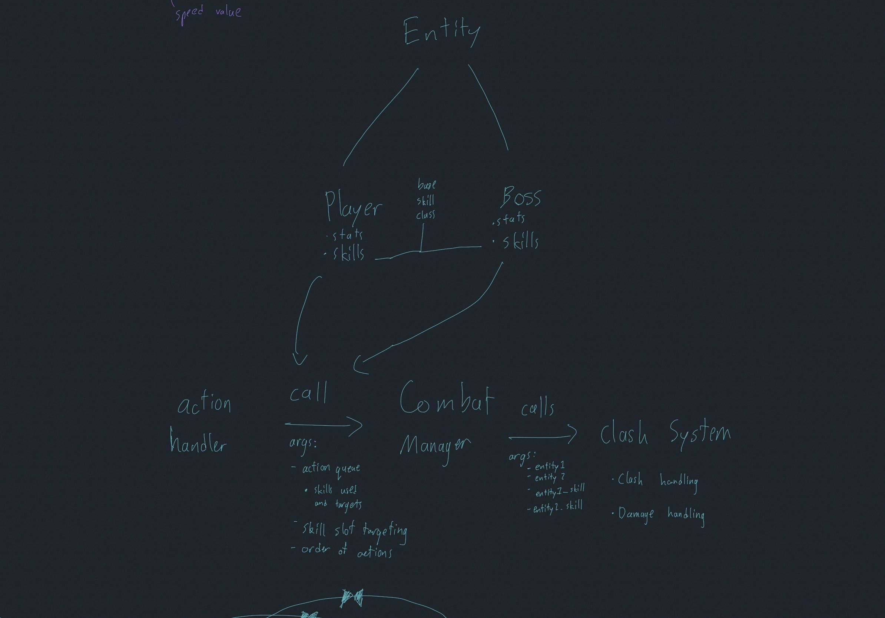

Initial Game Plan/Design - I drove a lot of the conversation regarding potential ideas for what game we should
make, which led into eventually creating the idea that would become BRR. I'm kind of sad a lot of game design elements
created by myself and the team never came to fruition, but that's just how things go sometimes.

Code Review - Reviewed all code being PR'ed and made comments on changes that needed to be made to prevent potential
problems compounding in the future.

Character Skill Design - Designed the skills for the characters. This ties into a few of the lectures in the course that
covered game design.

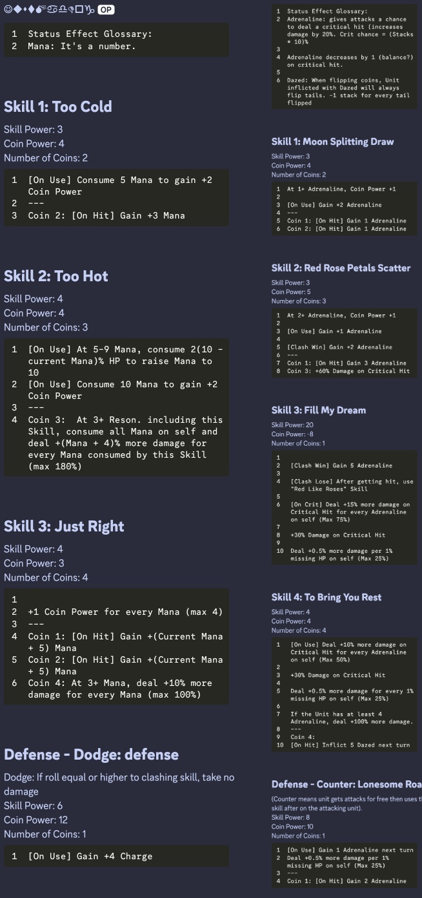

UI/Gameplay Initial Concepts - Drew up the initial UI concepts and gameplay mockups. Worked with Adriano to create the
first draft version of the UI.

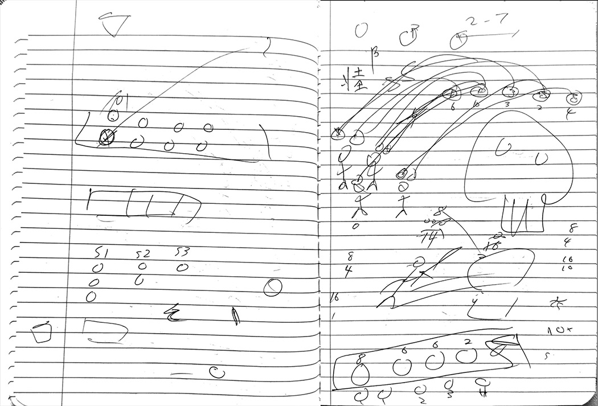
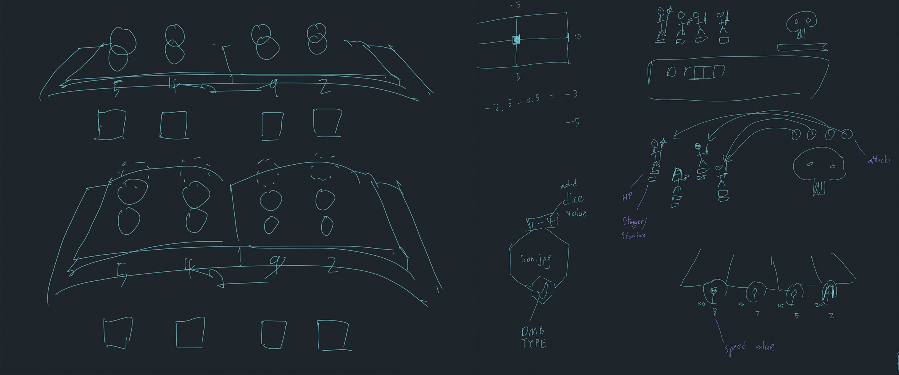
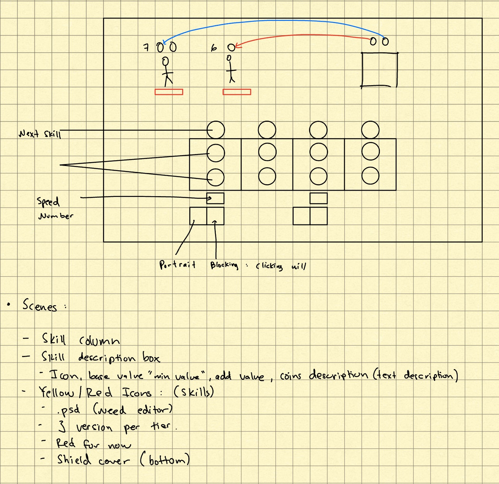
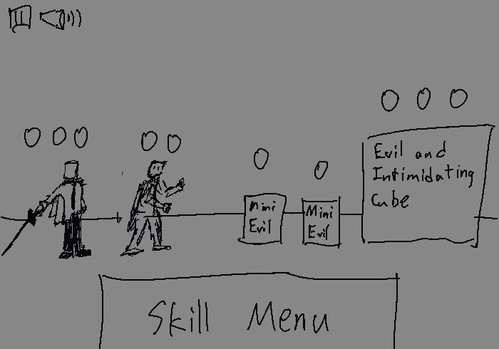

Subsystem Design - Designed the core gameplay subsystems (clashing, damage, skill selection, etc). The design of these
systems are based on the
lectures regarding game design for systems and mechanics. Designs were written out and sometimes given visual aids like
clashing below:

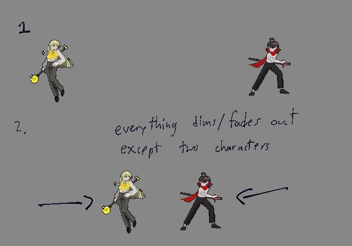
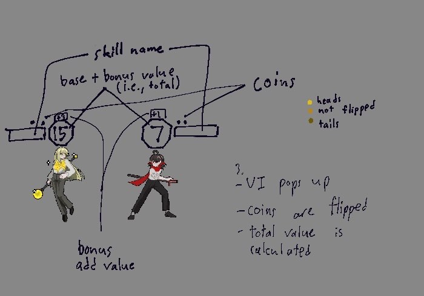
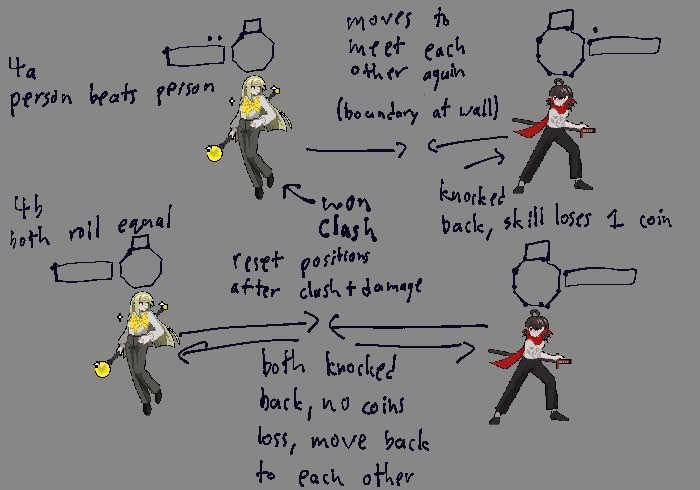

Skill Icons - Created the skill icons for both characters since no one had created them yet at the time.

Audio Asset Acquisition - Helped for audio assets since none had been found at the time.

---

For each team member, you shoudl work of your role and sub-role in terms of the content of the course. Please look at
the role sections below for specific instructions for each role.

Below is a template for you to highlight items of your work. These provide the evidence needed for your work to be
evaluated. Try to have at least four such descriptions. They will be assessed on the quality of the underlying system
and how they are linked to course content.

*Short Description* - Long description of your work item that includes how it is relevant to topics discussed in
class. [link to evidence in your repository](https://github.com/dr-jam/ECS189L/edit/project-description/ProjectDocumentTemplate.md)

Here is an example:  
*Procedural Terrain* - The game's background consists of procedurally generated terrain produced with Perlin noise. The
game can modify this terrain at run-time via a call to its script methods. The intent is to allow the player to modify
the terrain. This system is based on the component design pattern and the procedural content generation portions of the
course. [The PCG terrain generation script](https://github.com/dr-jam/CameraControlExercise/blob/513b927e87fc686fe627bf7d4ff6ff841cf34e9f/Obscura/Assets/Scripts/TerrainGenerator.cs#L6).

You should replay any **bold text** with your relevant information. Liberally use the template when necessary and
appropriate.

Add addition contributions int he Other Contributions section.

## Main Roles ##

## Sub-Roles ##

## Other Contributions ##
