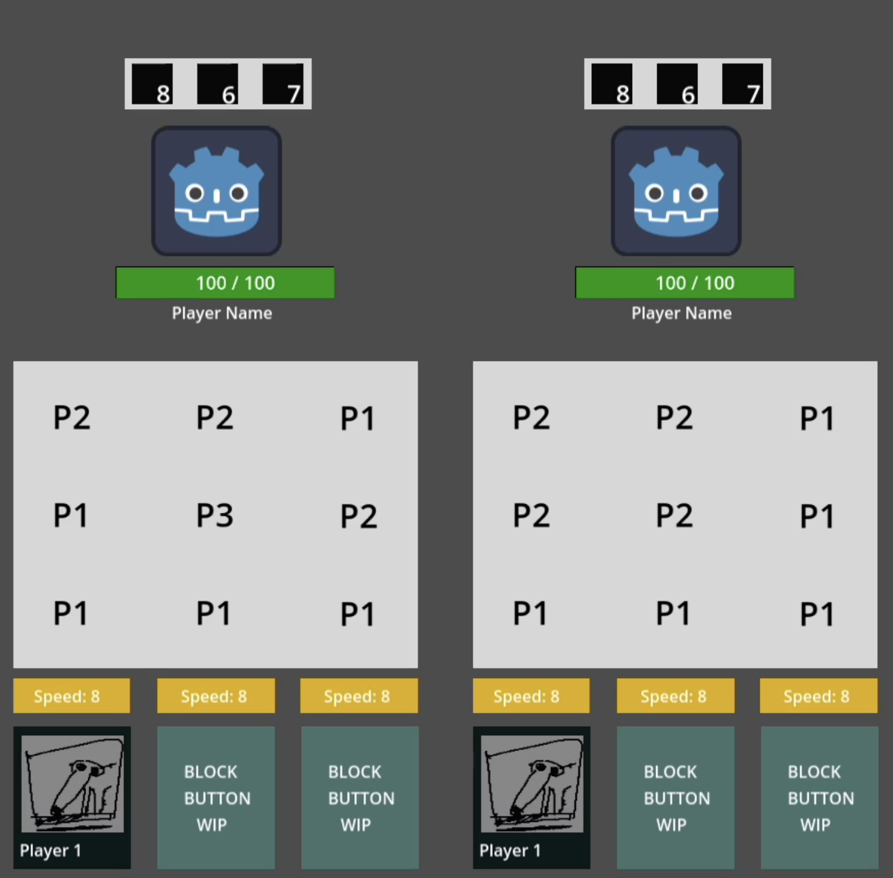
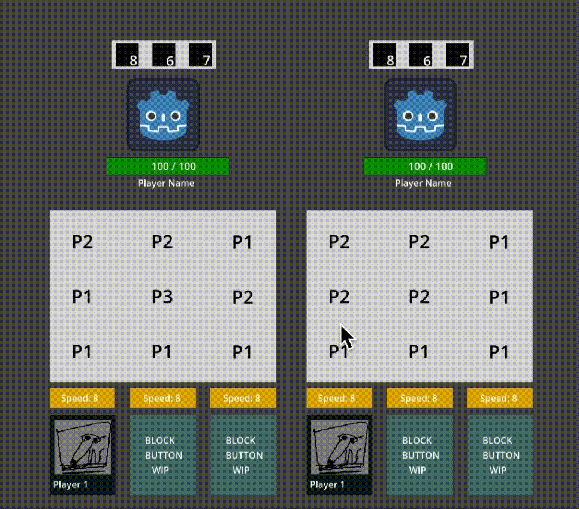
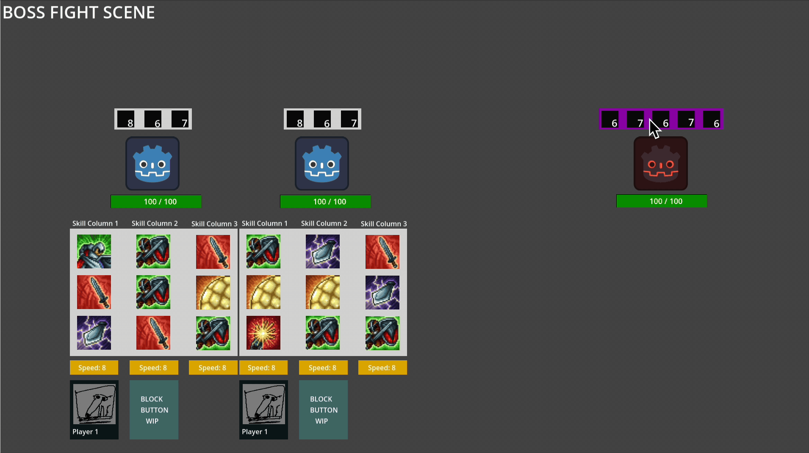
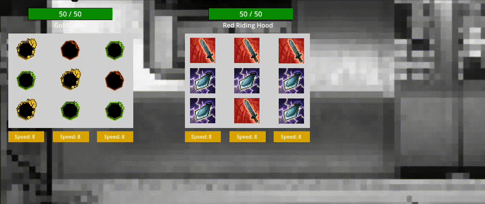
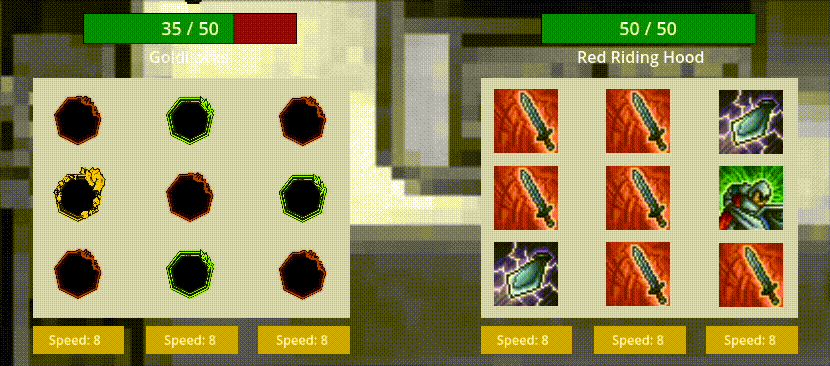

# Black Rabbit Rhapsody #

## Summary ##

Turn-based autobattler

## Project Resources

[Web-playable version of your game.](https://itch.io/)  
[Proposal: make your own copy of the linked doc.](https://docs.google.com/document/d/1jB2_lGxjSw8QCz2dgsFHjkJ77vtSrayT5uPSMNy5jAg/edit?usp=sharing)

## Gameplay Explanation ##

In battle, there is a skill selection UI that can be broken down into columns with each representing one attack slot.
Players can pick one of three available skills for an attack slot, or click on the button below (either portrait or
defend button) to queue up an attack skill instead. Skills are then processed in order from fastest to slowest (based on
speed number below the set of skills), left-to-right and pitted against the enemy's skills.

Player skills and enemies skills then clash against each other, rolling for highest number to see who gets to attack.
Players can do a QTE activated by clicking in order to gain more clash value. After clashing, whoever won the clash (
winning enough times to break all the enemy skill's coins) gets to attack with the remaining coins on their skill.

Once all skills are clashed or processed, the next turn begins. This goes on until one side is defeated.

**Strategy**
Pick big numbers to go up against enemy numbers. Defend when you feel like losing is inevitable.

**In this section, explain how the game should be played. Treat this as a manual within a game. Explaining the button
mappings and the most optimal gameplay strategy is encouraged.**

**Add it here if you did work that should be factored into your grade but does not fit easily into the proscribed roles!
Please include links to resources and descriptions of game-related material that does not fit into roles here.**

# External Code, Ideas, and Structure #

If your project contains code that: 1) your team did not write, and 2) does not fit cleanly into a role, please document
it in this section. Please include the author of the code, where to find the code, and note which scripts, folders, or
other files that comprise the external contribution. Additionally, include the license for the external code that
permits you to use it. You do not need to include the license for code provided by the instruction team.

If you used tutorials or other intellectual guidance to create aspects of your project, include reference to that
information as well.

Agentic tools were used for prototying an early draft of the UI code and for minor debugging.

# Team Member Contributions

This section be repeated once for each team member. Each team member should provide their name and GitHub user
information.

The general structures is

```
Team Member 1
  Main Role
    Documentation for main role.
  Sub-Role
    Documentation for Sub-Role
  Other contribtions
    Documentation for contributions to the project outside of the main and sub roles.

Team Member 2
  Main Role
    Documentation for main role.
  Sub-Role
    Documentation for Sub-Role
  Other contribtions
    Documentation for contributions to the project outside of the main and sub roles.
...
```

## Alexander Landess

### Github Username: anlandess

### Main Role: Game Logic

I primarily worked on creating and connecting the various subsystems of `battle_manager.gd` together and integrating
each character's skills data to all of the overarching systems. My main goal was connecting the systems together in a
cohesive and logical manner as well as ensuring that the necessary game data is being shared for the game to function.
For each script, I will provide a brief overview of what it does and what my contributions were to it.

### **I.** battle_manager.gd

Overview: Battle manager is effectively the super class. It is responsible for managing the other subsystems such as
`prelim_combat_handler`, `action_handler`, `combat_manager`, and `clash_system`.

My Contributions:

- Creating the original battle_manager.gd and integrating code snippets from other scripts in this new script.
- Implementing most of the original combat flow logic based on the battle's current state (like `PRE_BATTLE`,
  `SKILL_SELECTION`, `COMBAT`,
  etc), [which can be seen here](https://github.com/okpom/project-horse/blob/4d74331a5d6ea021cd82d9345edbd1e25285a133/scripts/battle_manager.gd#L4C1-L11C2).
- Creating the initial version of functions like
  `start_battle()` ([seen here](https://github.com/okpom/project-horse/blob/4d74331a5d6ea021cd82d9345edbd1e25285a133/scripts/battle_manager.gd#L79-L100)),
  `_start_skill_selection()` ([seen here](https://github.com/okpom/project-horse/blob/4d74331a5d6ea021cd82d9345edbd1e25285a133/scripts/battle_manager.gd#L104C1-L150C30)),
  and `_get_boss_skills()`. While these functions later got expanded upon or replaced by other team members (like for
  the clash system or UI integration), the main goal was to create a solid code foundation so that it would be easier to
  integrate other systems.

---

### **II.** action_handler.gd

Overview: Action handler is responsible for handling the characters' skill pools, skill selection, and other UI
interactions.

My Contributions:

- Implementing logic to handle generating skills when a character first spawns. When the skills data is obtained from
  the character's `SkillContainer`, these specs are then stored in `original_skill_pool`. This way, when a character's
  skill pool is depleted, we can easily replenish the skill
  pool [as seen here](https://github.com/okpom/project-horse/blob/4d74331a5d6ea021cd82d9345edbd1e25285a133/scripts/action_handler.gd#L49-L52).
- Assisting in connecting the characters' selectable skills to the skill selection UI. This also includes adding logic
  to provide the description box with the correct skill data such as its name, description, and stats.
- Added logic to differentiate clicking on the same skill type in a different row (i.e. clicking on Skill 2 while a
  different Skill 2 is selected should switch the skill being used to the newly clicked
  skill) [as seen here](https://github.com/okpom/project-horse/blob/4d74331a5d6ea021cd82d9345edbd1e25285a133/scripts/action_handler.gd#L790C2-L808C2).
- Creating a helper function SkillSlot, which allows for the skill targeting data to be directly fed into
  `combat_manager.gd` for clash/attack
  handling [as seen here](https://github.com/okpom/project-horse/blob/4d74331a5d6ea021cd82d9345edbd1e25285a133/scripts/action_handler.gd#L1183C1-L1206C33).
- Many miscellaneous changes that involve integrating skill logic into the overall system.

---

### **III.** combat_manager.gd

Overview: After skill selection is completed, `combat_manager.gd` takes the incoming skill queue and handles combat
logic.

My Contribution:

- Creating the initial `combat_manager.gd` and the initial `resolve_skills(skill_queue)` function. While I did not
  contribute to the actual combat handling logic, this function provided the necessary data (skill_queue from
  `action_handler.gd`) for the logic behind identifying and managing clashes. Effentially, it helped bridge the gap from
  the skill selection phase (in `action_handler.gd`) to the combat phase (in `combat_manager.gd`) by passing along
  essential skills-related data.

---

### **IV.** prelim_combat_handler.gd

Overview: When the player loads into the boss fight scene, `prelim_combat_handler.gd` is responsible for spawning
entities, loading skills, and applying skills to the UI.

My Contributions:

- Implementing `spawn_players()`, which inits the characters at set locations and adds them to the scene. This function
  is able to summon more than 2 characters had we decided to add a 3rd characters.
- Implementing `spawn_enemy()`, which inits the enemy at a set location.
- Moving and refactoring code snippets from a deprecated script `boss_fight_manager.gd` to better match our project's
  initial proposal infrastructure. This deprecated script was a placeholder way of directly interacting and modifying
  the game for testing purposes.

  ---

### **V.** Skills (in general)

Overview: Script that holds the data for each entity's skill data. Some skill data includes damage, odds for a head,
number of coins to flip, and more.

My Contributions:

- Implementing the base `skills.gd`
  class ([see here](https://github.com/okpom/project-horse/blob/4d74331a5d6ea021cd82d9345edbd1e25285a133/scripts/skills/skill.gd#L1C1-L2C13)).
- Filling out each character's skills node with meaningful attributes like Skill ID, Skill Name, Description, Copies in
  Deck, and so on with similar attributes.
- Implementing logic for handling skill effects such as `[On Head]`, `[On Hit]`, and
  `[On Use]` ([see here](https://github.com/okpom/project-horse/blob/4d74331a5d6ea021cd82d9345edbd1e25285a133/scripts/clash_system.gd#L264)).
- Contributed to hooking up each player's selectable skills with the UI itself. Previously it was showing placeholder
  skill data and not the actual character's skill data.

---

### **VI.** Misc Game Logic Contributions

Overview: Other things I contributed to that are worth mentioning.

My Contributions:

- Creating the base `entity.gd`, `player.gd`, and `boss.gd` classes. These classes had exportable parameters such as max
  health and speed.
- Creating a basic scene swapper script attached to the World
  node ([found here](https://github.com/okpom/project-horse/blob/4d74331a5d6ea021cd82d9345edbd1e25285a133/scripts/main.gd#L1C1-L21C27)).
  Allows for efficient scene swapping when swapping to a new scene.
- Creating a win/loss checker and the actual win/loss scene.

---

### Sub-Role: Gameplay Testing

Note: Due to the short timeframe time between the project being playable and the deadline for this project, some
gameplay testing took place prior to the project being 100% playable. As such, I think it's important to acknowledge
that even though some of the feedback that was received might be irrelevant or dated, there was still some useful
feedback that was gained. Thus, I will try to provide context for the state of the game at the time that each gameplay
tester played.

### **I.** Tester #1 (12/7/25)

State of the Game: Very basic skills (flat damage values, no buffs), no intro cutscene, no assets, no clash system (
there was only direct attacks).

---

Q1: Was there anything you found frustrating?

A1: The gameplay itself seems a bit more intuitive after playing around with it. I find it frustrating that there's no
fight information that gets displayed after someone gets hit apart from just looking at a person's health. If I'm not
paying full attention to the game, I feel like I might not see that the boss did a lot of damage to me.

---
Q2: Did the game feel too long, too short, or just about right?

A2: The game felt too short. There isn't much to do as a player apart from just clicking on the skills that do the most
damage.

---
Q3: Were there particular aspects that you found satisfying?

A3: It's nice seeing the selected skills show up on top of the player.

---
Q4: If you could change just one thing, what would it be?

A4: I would either change the skills to be more dynamic or add skills that do no damage but provide buffs.

---
Q5: What was missing from the game?

A5: All the background assets and character models.

---

## Kynan Lewis

### Level/World Designer

1. Implemented the clash system (as directed by Justin), which dictates the flow of combat and determines how damage is
   calculated and dealt. This is more of a game system than level design, so I will go into further detail in the other
   contributions section.

2. Created a system where characters would have varying speed, using the already existing skill_queue. Previously, every
   character as set to have the same speed, so the turn order always ended up just going left to right. After modifying
   the speeds, I made it so the boss would generally be faster, so they could target the palyers at random and create a
   varying turn order due to the clash system. I also implemented a randomizer so that speeds would be different each
   round within a defined range. The general ranges makes it so that Player 1 is slowest, Player 2 is in the middle, and
   the boss is the fastest, but with the randomizer they can occassionally overtake each other in order to change things
   up.

 


3. Ensured that all neccessary information would be available to the player through UI tweaks, including coin rolls,
   speed values, status values, and damage calculations. Since the combat mostly occurs without player input, the UI
   updates allow the player to follow along with the action even as it happens without their inclusion. Since this is
   mostly in the UI category, I will go into more detail in Other Contributions.


4. Scaled and modified the numbers for Player skills, and also designed the boss' skills. I also modified the health
   values according the characters' capabilities in order to create a reasonably challenging and engaging experience.
   With our fairly limited system of combat, there isn't much room for strategy. Therefore I focused on the numbers and
   coins to keep the combat engaging, so that it would still be fun to waitch the coin rolls during clashes and hope
   that you can win them.

### Game Feel

1. Made sure that the coins were fun to watch when they were being flipped. At Justin's suggestion I created a short
   time delay of 0.2 seconds between coin flips, which made them more satisfying. Also made the sprite animations for
   the coins, and I think I did a good job because the heads is a little cat face and it's cute. I also added a sound
   effect that plays when coins are tossed, when they land on heads, and when they are destroyed. These elements work in
   tandem so that the players will feel good to see the coin turn heads.

 


2. Added a scrolling banner which announces when clashes happen, which quickly pops in from the left to the right
   accompanied by a sound effect. This makes the the clash system more significant to react with, as opposed to when it
   just happens. I also made it so the banner scrolls for a direct attack so that it's easy to follow when a clash
   is/isn't happening.


3. The damage calculated from the coin flip appears on the screen right before the player and boss clash, creating an
   effect where the player will be in anticipation to see how their damage compares to the opponent and whether they
   will win or not.

4. Implemented all sound effects to the combat, especially those for coin flips and clash banner, which make those
   moments more satisfying. Sound effects are also applied to the characters for attacks, guarding and damage, making
   them feel more significant and weighty. The sound effects for the character actions were mostly implemented through
   the animation player to make them more consistent, while those that tied to game systems were done in the battle
   manager. Sound effects were all sourced from school projects, myself, or pixabay.com.

5. Implemented all animation and combat timings, allowing the battles to flow at a quick but easy to follow pace.
   Specifically, coin flips are easy to parse (which take about 2.5 seconds), then the result and its consequences are
   displayed for a couple seconds before moving on and keeping things moving. The actual attacks which deal damage,
   especially the combo attacks (seen in Red Riding Hood's animations), occur as the coins are landing to make them feel
   more snappy and satisfying.

 


### Other Contributions

1. Compiled Danielle's sprites into singular spritesheets for each character and implemented them into the game. This
   included recreateing them into the animation player, programming the logic for animation transitions, and fine-tuning
   the timing between animation and gameplay events (explained in Game Feel section).


2. Created spritework for the coins and implemented them into the game. This was done by creating a coin scene with
   animations to land on heads or tails, as well as the possiblity of breaking. The battle manager would instantiate the
   correct number, place them with equal spacing above the subject's head, and giving it instructions based on the
   signals received from clash system. One of these intructions include determining whether the first coin should break
   at the end of the round which the subject lost, which also has its own spritework.


3. Created UI for skill display and damage numbers. The UI appears next to the character's skill bar, shows the name of
   the currently used skill, and makes the calculated damage appear when the coins land. This is repeated for every
   round of the clash. The damage calculation is designed to only appear after the coins have actually landed, just
   before damage is dealt.


4. Implemented the existing health bar so that it would reflect the player's health and update when they take damage.

5. Created UI for the clash system that scrolls text when Clash is initiated, won, lost, and when no clash occurs so the
   character attacks directly. This was mostly done for game feel to make clashes more satisfying, but it is still
   important information to convey to the player.

6. Created a basic display to display the character's current status, namely mana and adrenaline amount. These systems
   were implemented by Aleks, so all I did was display them through a simple label that is updated by a signal.


7. Implemented a part of the UI to display each character's current speed, due to the varying speed system explained
   earlier.


8. Implemented the full clash system, including:

- Damage calucation based on coin flips
- The loser of each round losing a coin, which they will not be able to use for future rounds
- When a participant runs out of coins, the lose the round, and the winner is able to attack them with their remaining
  coins to deal damage.
- If a clash does not occur (which happens after the boss has used all of its skills), the character can attack directly
  without clashing to deal coins.
- Implemented all animations and timing associated with combat and clashing.
- Many signals are returned to the battle system in order to convey all the important information, which I used a lot
  for the prior UI handling.


9. Created an initial turn-based combat system, which was built upon to create battle manager. My implementation was
   very bare bones, and just automatically went in turns between a party of 2 characters and a boss, as they dealt a
   fixed amount of damaged to each other until one of them died.

10. Helped with early character designs and sketches.

 


11. Scaled all backgrounds and UI and sprites in the combat scene to fit comfortably on the screen.


# Xiaofeng Lin

### Systems and Tools Engineer

    asdf

### Build/Release Management

    asdf

### Other Contributions

    asdf

# Danielle Chang

*Note*: I found that a lot of the narrative aspect and the animation/visuals aspect for me and this game in particular
overlapped a lot. Also as I was trying to reference the lectures, a lot of them gave me an error where it said the link
had been disabled and "Sorry, access through this link has been removed by admin policy. Please contact the person who
shared it with you."

### Animation/Visuals

1. Moodboards
   Once our team settled on the broader game concept, the first thing I focused on was establishing a clear visual
   direction. To do this, I created a series of moodboards that captured the atmosphere, tone, and stylistic
   possibilities we had loosely discussed. I wanted all of us to share a concrete vision of what the world might look
   and feel like before moving into production. After experimenting with different aesthetics, my team and I ultimately
   combined one of my fairy-tale-inspired concepts with Justin’s more modern, urban direction. The result was what he
   described as an “urban fairytale” aesthetic—storybook characters and motifs integrated into a slightly run-down,
   contemporary setting, loosely inspired by 1980s–90s Hong Kong. This helped us shift the character designs away from
   traditional cloaks and tunics and toward everyday clothing like suits and ties, grounding them in a more modern
   reality while still retaining their fantastical origins.
   These are some of the moodboards I came up with and the last one is one of the final ones we went with.
   https://github.com/okpom/project-horse/blob/7609124f5c1385eb6bc26ec5babdcfc8b470a52e/DocImages/moodboard_1.jpg
   https://github.com/okpom/project-horse/blob/7609124f5c1385eb6bc26ec5babdcfc8b470a52e/DocImages/moodboard_2.jpg
   https://github.com/okpom/project-horse/blob/7609124f5c1385eb6bc26ec5babdcfc8b470a52e/DocImages/moodboard_3.jpg
   https://github.com/okpom/project-horse/blob/7609124f5c1385eb6bc26ec5babdcfc8b470a52e/DocImages/moodboard_4.jpg

3. Sprite Creation, Animation and Art Style
   With the aesthetic direction established, I began creating the first iterations of the character sprites. My goal was
   to explore what our chosen visual style might look like in practice, so I produced several sketches and poses for
   Red—a modern reinterpretation of Red Riding Hood, whose iconic hood I translated into a bright red scarf.
   https://github.com/okpom/project-horse/blob/5ff30ad465be0e6c9307d44809339e871b0fe58d/DocImages/art-4.jpeg
   https://github.com/okpom/project-horse/blob/5ff30ad465be0e6c9307d44809339e871b0fe58d/DocImages/art-5.jpeg
   https://github.com/okpom/project-horse/blob/5ff30ad465be0e6c9307d44809339e871b0fe58d/DocImages/art-6.jpeg
   https://github.com/okpom/project-horse/blob/5ff30ad465be0e6c9307d44809339e871b0fe58d/DocImages/art-7.jpeg
   I also made the animations in animation player in godot with the sprite sheets that I had made.
   Using these sprite sheets, I created animations in Godot’s AnimationPlayer. Drawing from the GameFeel lecture, I
   aimed for at least ten frames per second to ensure smooth motion and preserve the illusion of life. While not every
   animation reached this target, I prioritized the idle animation since it is the one players see most often. I also
   incorporated the principle—emphasized in lecture—that NPCs should always feel alive, even when the player is not
   directly interacting with them. This guided my decision to give both the boss characters and mobs detailed idle
   cycles as well as hurt animations that provided clear feedback whenever an attack successfully landed.
   I designed two main player characters inspired by instantly recognizable fairy-tale figures: Red (Red Riding Hood)
   and Yellow (Goldilocks). Both were reimagined with modern silhouettes and suits to fit the “urban fairytale” tone.
   For each character, I created a full set of animations: idle, run/move, several attacks, a guard stance, and a hurt
   animation. Their corresponding fairy-tale creatures—the wolf and the bear—were also designed and animated as
   bosses/mobs, building a visual connection between the characters and their origins.

3. Color Palletes
   Even after settling on the overall style and poses, I felt the visuals still didn’t fully communicate the blend of
   melancholy, grunge, and fairy-tale whimsy we were aiming for. After discussions with the team, I proposed shifting
   the entire world into black and white, reserving small bursts of color only for the most iconic character elements.
   This allowed the fairy-tale symbols—like Red’s scarf or Yellow’s gold hair—to stand out strongly against a muted and
   worn backdrop. This limited palette ultimately unified the characters, enemies, and environments while reinforcing
   the tone of a fractured fairytale world intruding into modern life.

4. Start Screen and Backgrounds
   Originally, I imagined a character-select system where the player flipped through a storybook, choosing heroes like
   pages in a fairy tale. Although we didn’t end up implementing this feature, I still wanted to honor that narrative
   concept. I incorporated it into the start screen instead, designing an open book filled with taped post it sketches
   of the characters and polaroid photos of the combat settings. This visual metaphor subtly reinforces that the
   characters may have stepped out of a storybook into the real world or that someone has been documenting their
   presence.
   https://github.com/okpom/project-horse/blob/5ff30ad465be0e6c9307d44809339e871b0fe58d/DocImages/Untitled_Artwork.jpg
   For the in-game environments, I created several modern urban backgrounds, most notably subway scenes, to blend the
   familiarity of real-world settings with the strangeness of fairy-tale creatures invading them. To enhance the surreal
   and grungy tone, I desaturated these backgrounds entirely, integrating them into the monochromatic palette that
   ultimately unified the visual identity of the game.

### Narrative Design

This game doesn't have much narrative focus on the gameplay, but I still wanted to communicate the game theme and that
modern fairy tale vibe so I did this through the character designs, settings/backgrounds, mobs, color pallette and game
start screen.

Although our game wasn’t heavily narrative-driven in terms of dialogue or plot progression, I still wanted the player to
feel a story through every visual and gameplay cue. Since the gameplay itself is quite fast-paced and combat-oriented, I
focused on embedding narrative meaning into the elements the player constantly interacts with—character silhouettes,
animations, environment tone, and the color language of the world. Much of this came from the “environmental
storytelling” concepts discussed in lecture: the idea that players should be able to infer what kind of world they are
entering simply by looking at how the characters move, what they wear, and where they are placed. To support this, I
designed Red and Yellow not just as redesigned fairy-tale figures, but as characters who visually communicate that their
fairy-tale identities have been disrupted and dropped into an urban world that doesn’t quite fit them. Their subtle
flashes of color reminded players of their origin stories, while everything else around them hinted that something has
gone wrong in the world those stories came from.

I also thought a lot about narrative consistency when creating the backgrounds and start screen.Because first
impressions is key when selling a game to a player, I wanted the very first screen to immediately tell the player that
this world blends storybook fantasy with contemporary grit. The open book concept—with its taped-down polaroids and
post-it sketches—became my way of narratively bridging the gap between the fairy-tale world and our modern setting. It
communicates that these characters might have escaped from a storybook, or that someone has been studying them and
documenting their appearance as they appear in the real world. Even though this isn’t explicitly stated anywhere, the
imagery plants the idea that the game world has a deeper lore and that the battles the player participates in are part
of something larger.

Finally, I used the enemies and animations to reinforce micro-stories within gameplay itself. The wolf and bear bosses
were chosen intentionally—not only because of their ties to Red and Yellow, but because having the monsters appear
corrupted or exaggerated compared to their human counterparts suggests a narrative imbalance or conflict between the
fairy-tale origins and the urban environment. Similarly, adding hurt animations, readable idle poses, and short visual
“tells” for attacks wasn’t only for GameFeel; it also helped communicate emotion and personality. The way the wolf
recoils, or the confident posture Yellow takes when guarding, gives players a glimpse into who these characters are
without needing lines of dialogue. In that sense, the narrative comes through in how characters inhabit their bodies and
react to the world around them, allowing the storytelling to emerge organically through gameplay actions rather than
explicit exposition.

### Other Contributions

I was quite busy this quarter and making all the sprites, animations, backgrounds, and other art assests took so much
time, so I wasn't able to provide any help to my teammates outside of moral support.

# Adriano Melo Filho

### UI/Input

1. Skill Population:



*(Early version: Px means populated with skill_ID = x)*

I implemented most of the Skill UI system. When the battle begins
the [PrelimCombatHandler](https://github.com/okpom/project-horse/blob/main/scripts/prelim_combat_handler.gd) spawns
player and initializes each player’s skill deck from their SkillContainer (init_skills()), creating three independent
column pools that generate randomized skills to the UI each turn. These pools are applied visually when the handler
populates each player’s 3x3 SkillsColumn grid using _populate_columns_with_random_skills() and _
apply_column_skills_to_ui() which replaces placeholder nodes with actual TextureRects nodes and attach skill metadata.

The boss’s skill population follows a separate system. Instead of using column pools or UI grids the boss generates
skills freshly each turn
through [BattleManager._get_boss_skills()](https://github.com/okpom/project-horse/blob/main/scripts/battle_manager.gd)
which uses a placeholder fully random AI *(might be updated after submitting this)*. For each of the three boss slots
the function picks a random skill from enemy.skills.pick_random(), randomly selects a player, and randomly selects one
of that player’s three skill-bar slots to target. Then it creates a SkillSlot containing the enemy user, the chosen
skill, the boss’s slot index and the randomly selected (target_player_index, target_slot_index). Once all three are
created, ActionHandler.set_boss_skills() stores them, and ActionHandler.populate_entity_skill_bar() replaces the boss’s
placeholder UI with actual TextureRect icons and metadata.

2. Skill Selection:

  

*(Early version: Populates over head skills by clicking one per bottom column)*

During the Skill Selection phase
the [BattleManager](https://github.com/okpom/project-horse/blob/main/scripts/battle_manager.gd) manages all UI
interaction and selection logic to
the [ActionHandler system](https://github.com/okpom/project-horse/blob/main/scripts/action_handler.gd).
First boss skills are generated and displayed using set_boss_skills() and populate_entity_skill_bar() allowing players
to see incoming attacks before choosing responses. Then the handler sets up internal player selection structures (
setup_selection(players)), generates targeting preview arrows (prepare_preview_arrows()) and attaches click handlers to
every selectable UI node via select_player_skills(). Each skill icon in the SkillsColumn is mapped directly to its
corresponding bar slot and selection is performed through _on_column_skill_gui_input() which constructs an
ActionHandler.SkillSlot object and stores it in player_selections[player][slot]. Clicking again removes the selection (
both handled by _on_bar_slot_gui_input() and _reset_bar_slot_visual()).

Players can't begin combat until all required slots are filled; set_skill_for_slot() triggers _check_if_complete() which
emits all_selections_complete() only when every slot across all living players contains a valid selection. After combat,
the system updates the UI dynamically: consume_used_skills() removes used skills from their column pools and
replace_used_skills_in_grid() updates only the specific grid nodes involved in the selection identified through
metadata (node.get_meta("used_in_slot")). Finally, clear_selections_and_ui() resets the Skill Bars and clears metadata
so the next Skill Selection phase begins with a fresh UI.

#### 3. Boss Targeting:



*(Arrows indicates which skill enemy plans on attacking during clash)*

Although it's not going to make the final cut, it's something I spent a fair amount of time on. I implemented the visual
targeting preview feature that displays curved red arrows from each boss skill slot to the player slot it plans on
hitting during the Skill Selection phase. When the BattleManager finishes generating boss skills the UI call
action_handler.prepare_preview_arrows() to rebuild the preview lines every turn. The function works by clearing all old
arrows from the BossSkillsBar via bar.boss_preview_arrows.get_children() to guarantee no stale visuals stay around. Then
it iterates over each SkillSlot in boss_skills extracting its source_slot_index, target_player_index and
target_slot_index and resolving both the start node (boss UI slot) and end node (that player’s SkillsBar slot). For each
valid pair, it instantiates a new PreviewArrow from bar.ARROW_SCENE, assigns its node_start and node_end references and
adds it to the boss_preview_arrows container. Arrowed are invisible by default so they don’t clutter the UI until
needed.

The arrow is rendered in real time inside PreviewArrow._process() where the script samples the global positions of both
UI nodes each frame and generates a smooth curve between them. The arrow is trimmed using trim_start and trim_end so it
doesn’t visually overlap the UI icons, and the midpoint of the curve is lifted by curve_height giving each arrow its
distinctive high arc. I used two layered Line2D nodes (OutlineLine and MainLine) to create an outlined red effect for
clarity. Each arrow recomputes its curve every frame even as UI elements move or animate.
To control visibility I connected the boss’s HoverArea directly to _on_boss_hover_enter() and _on_boss_hover_exit()
using connect_boss_hover_signals(). When the cursor enters the boss model every arrow inside boss_preview_arrows becomes
visible including multiple overlapping arrows targeting different players. When the cursor leaves, they all hide again.

#### 4. Skill Description Boxes:

  

*(Icons Not Finalized)*

I implemented the foundation for
the [Skill Description Box system](https://github.com/okpom/project-horse/blob/main/scripts/UI/skill_description_box.gd)
that provides the UI layout and the core API for showing and hiding description information. This included building the
SkillDescriptionBox scene (panel, labels, icon slot, stats fields) and writing the initial script with functions such as
show_for_skill(), update_icon(), and hide_box(). My group expanded the system by integrating the real logic for loading
skill information on hover. Instead of relying on the placeholder show_for_skill() method he embedded the skill
description population directly into the hover callback inside ActionHandler (_on_skill_hover_enter). This approach
allows the description box to pull the exact skill metadata—display name, description, rolls, coin count, and computed
odds—at the moment the mouse hovers over a skill icon in the SkillsColumn. His implementation searches for the correct
SkillDescriptionBox instance under the player’s SkillsColumn, accesses all UI nodes inside the panel (Name,
SkillDescription, Stats, etc.), and writes the appropriate values taken from the Skill object. This ensures that the
description box always reflects accurate, per-skill data.

#### 5. Player/Boss Healthbars:

  

I wrote
the [original full HealthBar system](https://github.com/okpom/project-horse/commit/7a5a60d3f4400064cd71287639e9f448e37c6b69#diff-23803dbd84edd299c0f8be7fb2e0807c382ec194944d6eba587189fc7bf92abaR2)
where the bar stored its own health values, updated itself when damaged or healed, emitted signals and handled
portrait/name setup. My group later simplified and refactored it so the bar no longer manages gameplay logic. Instead
the updated [HealthBar](https://github.com/okpom/project-horse/blob/main/scripts/UI/player_health_bar.gd) now attaches
to its parent Entity and only reads current_hp and max_hp to update the UI. The Entity.take_damage() method now calls
hb.refresh() meaning the entity controls the health logic while the bar only handles display. In short, I created the
full original feature, and my group streamlined it into a clean, entity-driven UI component.

### Audio

#### 1. Gameplay Music:

I implemented a scene driven music system from
the [title screen](https://github.com/okpom/project-horse/blob/main/scripts/title_screen.gd), into
a [cutscene](https://github.com/okpom/project-horse/blob/main/scripts/dialogue/cutscene_manager.gd) and finally into
the [multi phase boss battle](https://github.com/okpom/project-horse/blob/main/scripts/battle_manager.gd). I set up the
architecture for the music logic across all affected scenes, while my group helped attach the final audio assets and
organize the exported fields in each scene for easier editor control.
On the [Title Screen](https://github.com/okpom/project-horse/blob/main/scripts/title_screen.gd) I added a dedicated
AudioStreamPlayer2D and bound it to a new exported variable menu_music in title_screen.gd. This allows the menu to start
playing the assigned track immediately on load using Godot’s autoplay behavior.

For Cutscenes I expanded
the [CutsceneManager](https://github.com/okpom/project-horse/blob/main/scripts/dialogue/cutscene_manager.gd) by
introducing a cutscene_music export and a corresponding MusicPlayer node. When a cutscene begins in play_cutscene(), the
manager loads the appropriate track, assigns it to the player, and starts playback. When the cutscene ends, _
end_cutscene() stops the audio and the system returns control to the boss fight scene.

#### State Changing Music:

The Boss Fight required the most work. I added four dedicated audio players to the BossFightManager scene:
SkillMusicPlayer, CombatMusicPlayer, VictoryMusicPlayer and DefeatMusicPlayer. These players are connected to new
exported AudioStream fields in battle_manager.gd: skill_selection_music, combat_music, victory_music and defeat_music.
With these exports anyone from group can swap tracks directly in the inspector without touching code.

The main peice of the system is the _update_music() method
in [BattleManager](https://github.com/okpom/project-horse/blob/main/scripts/battle_manager.gd). It shuts off all tracks
then enables the specific player associated with the current battle state (SKILL_SELECTION, COMBAT, END_WIN, END_LOSS).
Music transitions automatically happen whenever the state changes skill selection plays its own theme, combat switches
to the main boss music and victory/defeat tracks are triggered when the encounter ends. This makes the soundtrack fully
state driven and eliminates earlier ad-hoc checks like if combat_music_player.playing.

Some of the songs I chose:

[RPG Game Music by alkakrab](https://alkakrab.itch.io/50-tracks-rpg-game-music-pack).

[8Bit Fantasy Adventure by xDeviruchi](https://xdeviruchi.itch.io/8-bit-fantasy-adventure-music-pack).

[16Bit Fantasy Adventure by xDeviruchi](https://xdeviruchi.itch.io/16-bit-fantasy-adventure-music-pack).

### Other Contributions

Rough quarter... Didn't even have time to get all my deliverables complete :(

# Justin Pak

### Producer

Project Trello (https://trello.com/b/zCzT0oPH/project-horse-ecs-179) - Project planning and task tracking kanban board
for helping people know what they have to do, when they have to finish, and who has to work on it. I chose to use a
Kanban board
over a Gantt chart because I thought it would fit better with our team's dynamic and working process.
Also included were milestones implemented at the start of development. Other than being a part of the producer
deliverables, project planning was discussed as a part of class during lectures regarding the project and tools you can
use to help with the
process. My goal with the Trello was to help the team make sure they knew at all times what needed to be done, who was
working on what, and when things were due.

One challenge our team had was hitting reaching milestones with most of the additions coming in at the eleventh hour. I
should've made the decision to have the team pivot to an idea that better fit our team's capabilities/schedules, but
went against my gut feeling since the others wanted to follow through on the idea, so I decided to try and push through
despite our delays.

[GDScript Format Workflow](https://github.com/okpom/project-horse/blob/main/.github/workflows/gdscript-format.yml) -
Made a GitHub workflow for automatically formatting all pushed gdscript files. This allows
everyone to
code in their own preferred style while ensuring that all final code aligns to one consistent style. This workflow is
based on the
portion of the course that covered Godot code style and best practices.

Assigning Tasks, Holding Meetings - Listed Deliverable. Held regular team meeting to make sure everyone was on the same
page and took minutes for each meeting.


GitHub Logistics - I created the development process for the team to use when making submission to the team repo. I
enforced pull requests and code reviews to prevent accidental breaking of the codebase while also promoting good
practices.

Other Producer Stuff - Tried to help be a force multiplier for the team. Helped act as a middleman between team members.
Coordinated responsibilities and task. Keep everyone on the same page. Helped support any other team members who need
assistance. Managed deadlines and scope. Made choices when things had to be delayed or scoped down. Worked to fix merge
conflicts, squash bugs, and assisted any members that needed support with their roles (programming or otherwise).

### Visual Cohesion/Style Guide

Moodboard/Style Guide - I worked with Danielle to nail down what the core aesthetic of the game should be. She created
the first set of moodboards and I created the second set to lock in on what the game's visuals would be like.
Originally, the game was leaning more towards gothic or fantasy elements.


Later, we decided to go for an "urban fairytale" aesthetic that incoporates storybook and fairytale characters and
motifs into a slight run-down urban setting (one of the initial inspiration was Hong Kong in the 80/90s). The characters
moved away from cloaks and tunics and more towards suits and ties.


As assets were being developed, I helped make sure that characters, enemies, and the environment aligned with the visual
style that was created.

There are some things that some might see as off like the coin graphics, but I wanted there to be some whimsy to
contrast with the "grittiness" of the setting here and there. I felt the coins did a decent job without detracting too
much.

Color Palette Guidance - I worked with Danielle to ensure the art in the game aligned with the palette that was decided
upon (muted colors with clear grayscale values). Art was checked to make sure this aligned with the game's theming and
any changes regarding color were made directly on the image files themselves, saving us time on requiring in-engine
color adjustments. We were able to do this because we weren't doing anything related to lighting in the game itself.

### Other Contributions

High Level Design - The game's original high level design consists of separate classes being handled by a global state
machine. The intent was to break down the subsystems so that they are compartmentalized and can be worked on
independently of each other. This system is based on portion of the course that covered different ways of creating
systems (specifically the part that covered states).


Initial Game Plan/Design - I drove a lot of the conversation regarding potential ideas for what game we should
make, which led into eventually creating the idea that would become BRR. I'm kind of sad a lot of game design elements
created by myself and the team never came to fruition, but that's just how things go sometimes.

Game Feel: I worked with Kynan to help time the animations and gameplay events to make the game flow more smoothly. One
example was how originally the skill coins flipped all at once and landed at the same time. This made it feel kind of
static, so I suggested that the flips be delayed a bit between all the coins and that character's attack animation
frames be timed with the flips as well.

Code Review - Reviewed all code being PR'ed and made comments on changes that needed to be made to prevent potential
problems compounding in the future.

Character Skill Design/Implementation - I designed the skills for the characters implemented them into the game with
Alex. The skills felt overtuned due to some core and boss mechanics being stripped. Kynan assisted with reeling the
numbers back in to get them to a better state. This ties into a few of the lectures in the course that
covered game design.


UI/Gameplay Initial Concepts - Drew up the initial UI concepts and gameplay mockups. Worked with Adriano to create the
first draft version of the UI.


Subsystem Design - Designed the core gameplay subsystems (clashing, damage, skill selection, etc). The design of these
systems are based on the
lectures regarding game design for systems and mechanics. Designs were written out and sometimes given visual aids like
clashing below:


Skill Icons - Created the skill icons for both characters since no one had created them yet at the time.


---

For each team member, you shoudl work of your role and sub-role in terms of the content of the course. Please look at
the role sections below for specific instructions for each role.

Below is a template for you to highlight items of your work. These provide the evidence needed for your work to be
evaluated. Try to have at least four such descriptions. They will be assessed on the quality of the underlying system
and how they are linked to course content.

*Short Description* - Long description of your work item that includes how it is relevant to topics discussed in
class. [link to evidence in your repository](https://github.com/dr-jam/ECS189L/edit/project-description/ProjectDocumentTemplate.md)

Here is an example:  
*Procedural Terrain* - The game's background consists of procedurally generated terrain produced with Perlin noise. The
game can modify this terrain at run-time via a call to its script methods. The intent is to allow the player to modify
the terrain. This system is based on the component design pattern and the procedural content generation portions of the
course. [The PCG terrain generation script](https://github.com/dr-jam/CameraControlExercise/blob/513b927e87fc686fe627bf7d4ff6ff841cf34e9f/Obscura/Assets/Scripts/TerrainGenerator.cs#L6).

You should replay any **bold text** with your relevant information. Liberally use the template when necessary and
appropriate.

Add addition contributions int he Other Contributions section.

## Main Roles ##

## Sub-Roles ##

## Other Contributions ##
